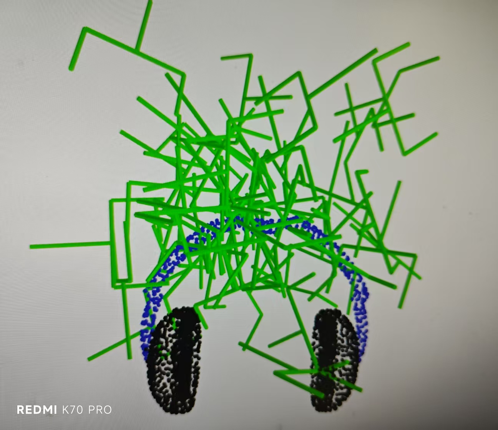
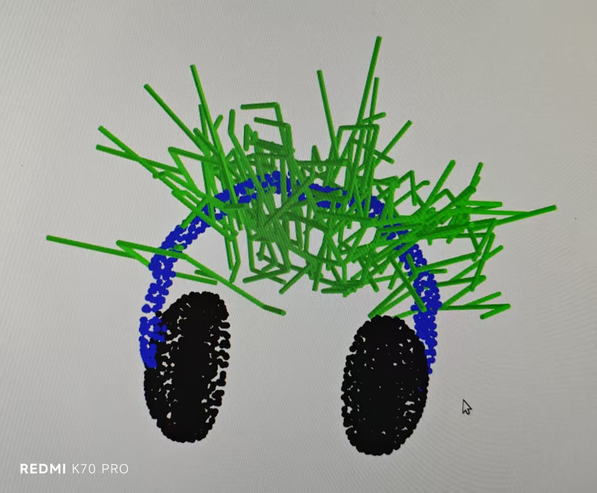
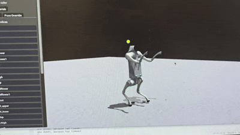
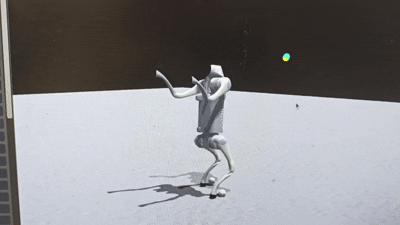
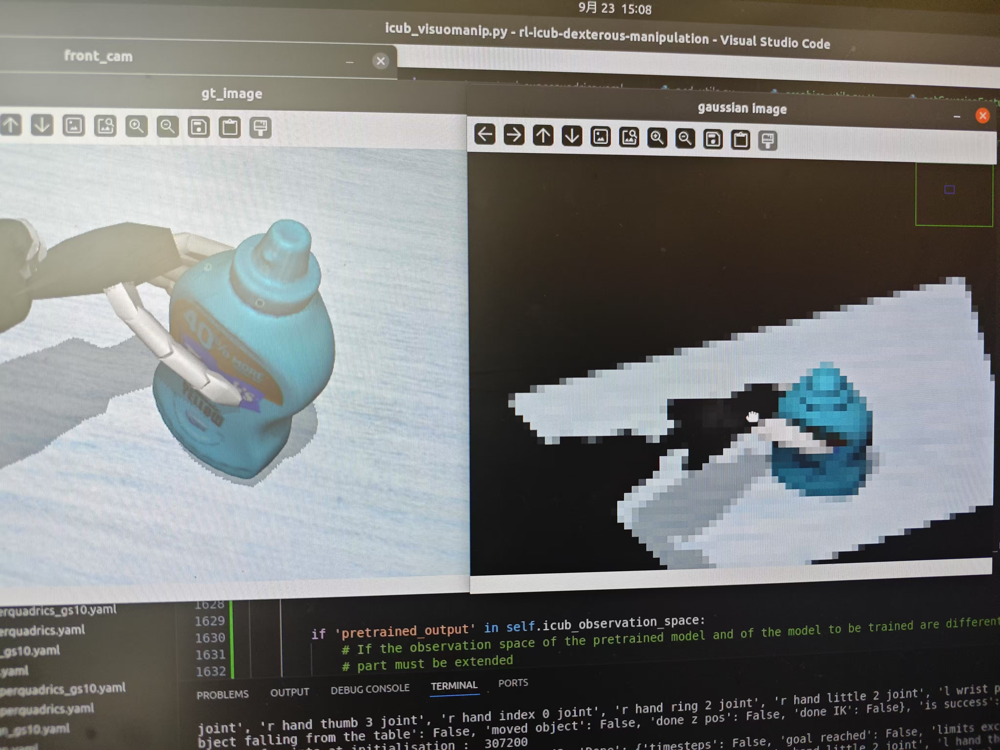
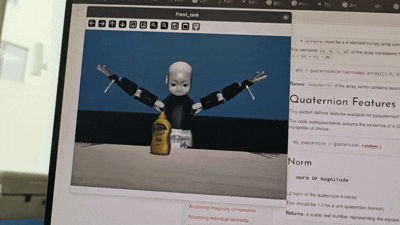

Hi there 👋  
I am Lijian, a Research Assistant at the shanghaitech MARS Lab, working with Prof. Sören Schwertfeger.  
Currently, my work is focused on **Dexterous Hand Manipulation**, **Diffusion Models**, and **Quadruped Control**.  

Before joining ShanghaiTech, I worked at the Industrial and Commercial Bank of China Software Development Center (Beijing). I obtained my Bachelor Degree in Computer Science and Technology from Tianjin University of Finance and Economics in 2020.  

## Papers  
**High-Quality, ROS Compatible Video Encoding and Decoding for High-Definition Datasets**  
*Li, Jian | Xu, Bowen | Schwertfeger*  
ROBIO 2024  

## Project Experience  

### Generation of 6DOF Grasp Poses using Internal Constraints and Open Semantic Affordance  
*Utilizing Flowmatching and RL (Work in Progress)*  
- Our work aims to improve the generation effect of the 2024 ICRA article *Language-Conditioned Affordance-Pose Detection in 3D Point Clouds*.  
- So far, our pose generation effect has far exceeded that of the article, with nearly **90%** of the generated poses being correct.  
<table>
    <tr>
        <td></td>
        <td></td>
    </tr>
</table>
- Left LCAP Generation Effect
- right Our Model's Effect   
- We will subsequently conduct real-world testing using the Fetch Robot   

### Quadruped Robot Upright Grasping Project  
*(Work in Progress)*  
- Responsible for the training of upright balance and walking gaits for the UNITree GO2.
- Currently I am focused on solving the upright gait and balance without commands.
- 
    <tr>
        <td></td>
        <td></td>
    </tr>

### Dexterous Hand Grasping Using 3D Gaussian Splatting
- The project is based on the 2024 RAL paper "RESPRECT: Speeding-up Multi-fingered Grasping with Residual Reinforcement Learning."  
- Integrated Gaussian Splatting code into the paper's code to train a Gaussian set prediction network, accelerating Gaussian inference during RL training.  
- Developed mirroring code for actions and observations, deploying the right-hand grasping strategy to the left hand.  
- 
    <tr>
        <td></td>
        <td></td>
    </tr> 

### ShanghaiTech Mapping Robot SLAM Dataset 
- Collected campus datasets using the Mapping Robot and Faro.  
- Tested different encoders and their settings to find the optimal configuration in terms of compressing visual SLAM dataset results, size, quality, and encoding time.    
- Developed scripts for compressing and playing back datasets, achieving a 55x compression ratio. Produced a ROBIO paper.  
- Using the Faro dataset as ground truth, wrote a program to annotate dynamic objects by comparing point clouds from two datasets (still in progress).  
