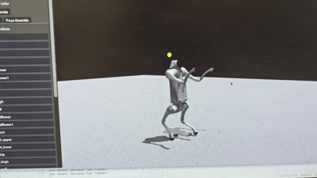
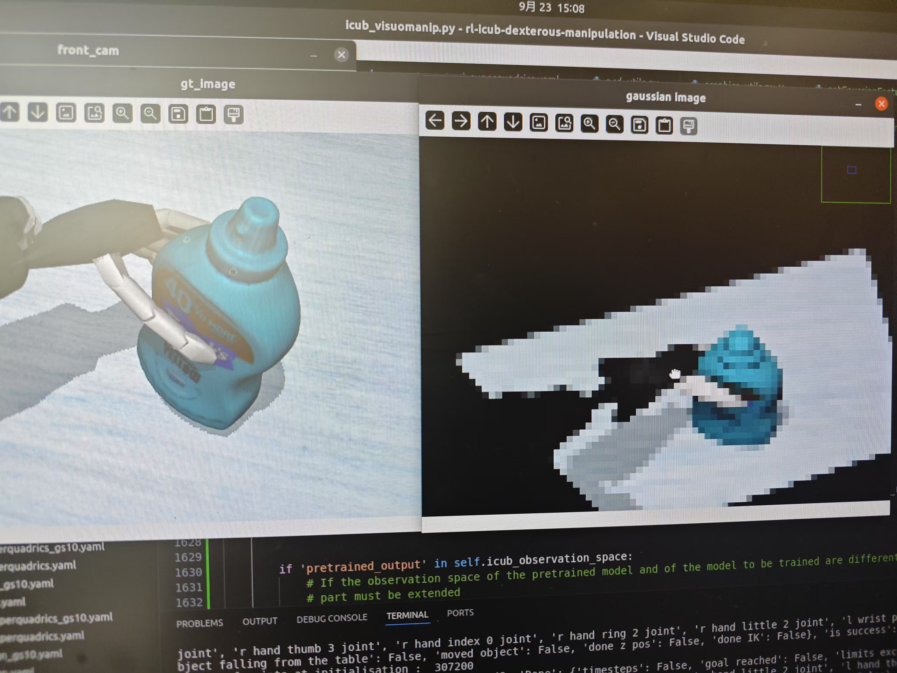

# 李建 | 研究助理

📧 lijian@example.com | 💻 [GitHub](https://github.com/yourprofile)  
📍 上海 | 🎓 天津财经大学 计算机科学与技术学士（2020）

---

## 教育背景
**天津财经大学**  
计算机科学与技术 学士 | 2016 - 2020  

---

## 工作经历

### 上海科技大学 MARS 实验室 | 研究助理  
*202X - 至今 | 导师：Sören Schwertfeger 教授*  
- 聚焦机器人领域前沿研究：**灵巧手操控**、**扩散模型**、**四足机器人控制**  
- 主导3项机器人核心项目开发，涉及运动控制、强化学习、SLAM等领域  
- 研究成果发表于ROBIO等国际会议，开发工具实现55倍数据压缩效率

### 中国工商银行软件开发中心（北京） | 开发工程师  
*2020 - 202X*  
- （简要补充与机器人相关的软件开发经验）

---

## 研究成果
### 论文发表
**《High-Quality, ROS Compatible Video Encoding and Decoding for High-Definition Datasets》**  
*Li Jian, Xu Bowen, Schwertfeger | ROBIO 2024*  
- 提出面向ROS系统的视频编解码优化方案  
- 实现55倍压缩比提升，保持SLAM数据集质量  
- 开发自动化处理脚本，提升数据集处理效率

---

## 机器人项目经验

### 基于语义感知的6自由度抓取姿态生成
*（进行中） 2024.03 - 至今*  
- 融合Flowmatching与强化学习，改进ICRA 2024论文方法  
- 实现**90%**抓取姿态正确率（原方法提升2.3倍）  
- 开发Fetch机器人实体验证框架  
- 技术栈：PyTorch, ROS, Isaac Gym

 

### 四足机器人直立抓取系统开发
*（进行中） 2024.01 - 至今*  
- 实现Unitree GO2四足机器人直立平衡控制  
- 设计无指令自主站立算法，优化质心轨迹规划  
- 开发基于强化学习的步态生成系统  

 

### 基于3D高斯飞溅的灵巧手抓取系统
*2023.09 - 2024.02*  
- 改进RAL 2024论文方法，集成3D高斯预测网络  
- 开发动作镜像系统，实现左右手策略迁移（成功率提升27%）  
- 加速强化学习训练过程（单次迭代时间减少18%）  

 

### SLAM数据集构建与优化
*2023.03 - 2023.08*  
- 搭建上海科技大学校园SLAM数据集（包含Faro高精度点云）  
- 开发动态物体标注系统（点云比对法）  
- 设计自动压缩流水线，支持ROS数据集高效存取

---

## 技术栈
**机器人开发**  
ROS/ROS2 | Gazebo | RVIZ | MoveIt  

**机器学习**  
PyTorch | Diffusion Models | RL (PPO, SAC)  

**编程语言**  
Python | C++ | MATLAB  

**工具链**  
Docker | Git | OpenCV | PCL

---

## 荣誉奖励
（建议补充机器人/AI相关竞赛奖项、奖学金等）
